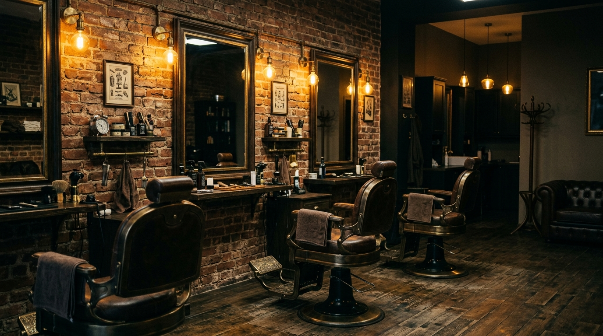

# ✂️ BarberCraft — Landing Page Premium

> **Estilo que define. Confiança que transforma.**

Landing Page responsiva para a **BarberCraft**, um estúdio de estética masculina premium. Desenvolvida como projeto do **Desafio 01 — Kodie**.

---

## 🔗 Links

- 🌐 **Site Publicado:** [Acesse aqui via GitHub Pages](#) *(atualizar após deploy)*
- 📁 **Repositório:** [GitHub](#) *(atualizar após deploy)*

---

## 📸 Preview



---

## 🛠️ Tecnologias Utilizadas

| Tecnologia | Uso |
|---|---|
| **HTML5** | Estrutura semântica da página |
| **CSS3** | Estilização externa, animações, responsividade |
| **Google Fonts** | Tipografia premium (Playfair Display + Inter) |
| **Git & GitHub** | Versionamento e publicação |
| **GitHub Pages** | Hospedagem gratuita do site |

---

## 📋 Estrutura do Projeto

```
Desafio Kodie/
├── index.html              # Página principal (HTML semântico)
├── style.css               # Estilos externos (CSS3)
├── assets/
│   └── images/             # Imagens geradas por IA
│       ├── hero-bg.jpg
│       ├── about-barber.jpg
│       ├── gallery-01.jpg
│       ├── gallery-02.jpg
│       ├── gallery-03.jpg
│       ├── gallery-04.jpg
│       ├── gallery-05.jpg
│       └── gallery-06.jpg
└── README.md               # Documentação do projeto
```

---

## 🧱 Seções da Landing Page

1. **Header** — Logo e menu de navegação com hambúrguer CSS-only para mobile
2. **Hero** — Título impactante, slogan e botão CTA
3. **Sobre** — Apresentação da BarberCraft com imagem e estatísticas
4. **Serviços** — 4 cards: Corte Clássico, Barba & Bigode, Tratamento Capilar, Combo Premium
5. **Galeria** — 6 fotos do ambiente, serviços e resultados
6. **Contato** — Formulário completo + aside com informações de contato
7. **Footer** — Links de navegação, redes sociais e créditos

---

## ♿ Acessibilidade

- ✅ Atributo `lang="pt-BR"` no `<html>`
- ✅ Todas as imagens com `alt` descritivo
- ✅ Hierarquia correta de títulos (`h1` > `h2` > `h3`)
- ✅ Labels associados a inputs (`for`/`id`)
- ✅ `aria-label` nos links e elementos interativos
- ✅ Focus visible em todos os elementos focáveis
- ✅ Contraste de cores adequado (WCAG AA)
- ✅ `@media (prefers-reduced-motion)` para acessibilidade de movimento

---

## 📱 Responsividade

O site é **mobile-first** e foi testado em 3 breakpoints:

| Dispositivo | Largura | Recursos |
|---|---|---|
| **Mobile** | < 480px | Menu hambúrguer, 1 coluna, layout empilhado |
| **Tablet** | 768px+ | 2 colunas serviços, 3 colunas galeria |
| **Desktop** | 1024px+ | 4 colunas serviços, layout completo |

---

## 🤖 Uso Consciente da IA

A Inteligência Artificial foi utilizada como **ferramenta de apoio** durante todo o desenvolvimento. Abaixo, a documentação completa dos prompts e como a IA auxiliou:

### Geração de Imagens
| Imagem | Prompt Utilizado |
|---|---|
| **Hero (fundo)** | "Professional barber shop interior, dark moody atmosphere, warm golden lighting, vintage leather barber chairs, exposed brick walls..." |
| **Sobre** | "Professional barber carefully cutting a man's hair in a premium dark barber shop, warm golden lighting..." |
| **Galeria 01** | "Classic men's haircut side profile, perfectly styled pompadour fade haircut..." |
| **Galeria 02** | "Professional beard trimming and grooming in premium barbershop, close up of barber using straight razor..." |
| **Galeria 03** | "Barbershop tools and accessories flat lay on dark wood surface, vintage straight razor, scissors..." |
| **Galeria 04** | "Man relaxing in barber chair receiving hot towel treatment on face, luxury barbershop spa experience..." |
| **Galeria 05** | "Modern barbershop waiting area with dark leather chesterfield sofa, whiskey glasses on side table..." |
| **Galeria 06** | "Close up of barber applying hair styling product pomade to man's hair, precise hand work..." |

### Apoio no Desenvolvimento
- **Paleta de cores:** A IA sugeriu a combinação dark/gold para transmitir premium e masculinidade
- **Textos e copy:** Auxílio na criação do slogan, descrições dos serviços e textos da seção "Sobre"
- **Estrutura HTML:** Orientação sobre uso correto de tags semânticas e hierarquia de títulos
- **CSS responsivo:** Ajuda na implementação do menu hambúrguer CSS-only (sem JavaScript)
- **Acessibilidade:** Revisão dos atributos `alt`, `aria-label`, contraste de cores e focus states

### ⚠️ Importante
Todo o código foi **compreendido e validado** pelo desenvolvedor. A IA serviu como ferramenta de apoio para acelerar o desenvolvimento, mas cada escolha técnica foi entendida e pode ser explicada.

---

## 🎨 Identidade Visual

| Elemento | Detalhe |
|---|---|
| **Paleta** | Preto `#0a0a0a`, Dourado `#c9a84c`, Branco fumê `#f5f0eb`, Cinza `#1a1a1a` |
| **Fontes** | Playfair Display (títulos) + Inter (corpo) |
| **Estilo** | Dark mode premium com acentos dourados |

---

## 📝 Licença

Este projeto foi desenvolvido para fins educacionais como parte do **Desafio 01 — Kodie**.

---

Desenvolvido com ☕ e dedicação | 2026
